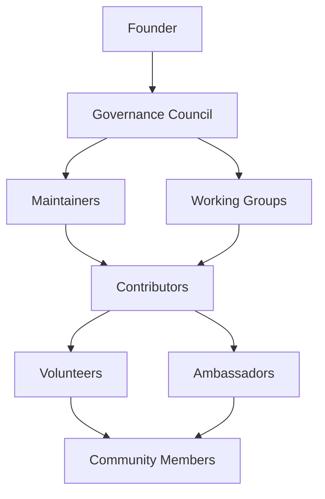
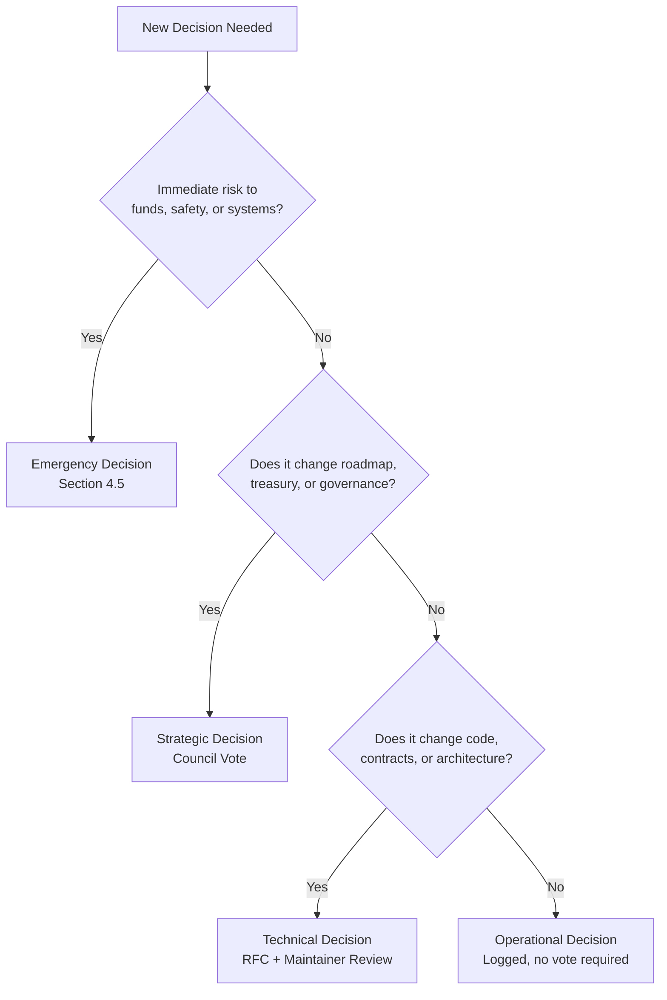
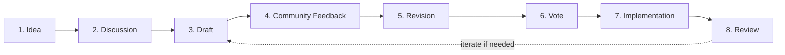
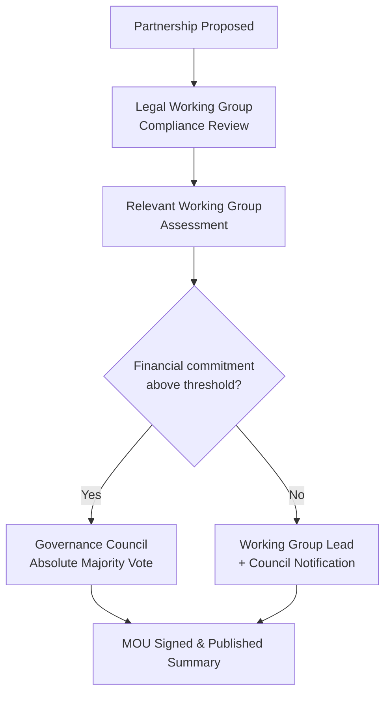
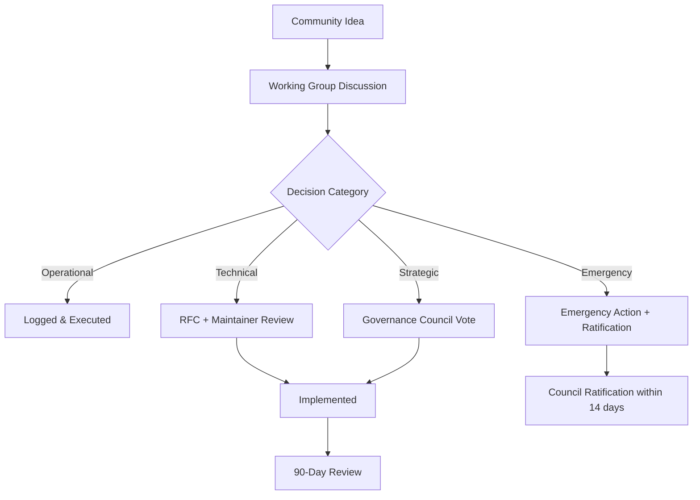
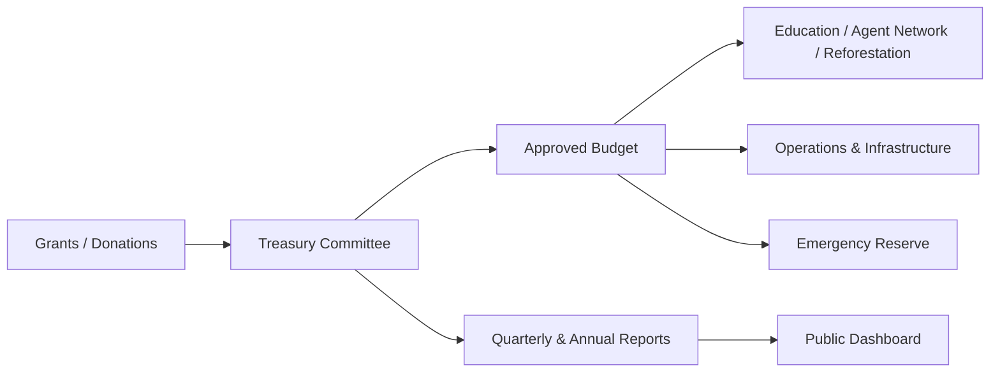

# CeloHT Governance

**Version 1.0 · Effective Date: August 2026**

This document defines how the CeloHT project is governed. It applies to every contributor, maintainer, working group, and community member participating in CeloHT repositories, forums, events, and communication channels.

CeloHT is an open-source, community-driven, non-token initiative built on the Celo blockchain. CeloHT is **not** a DAO, **not** a cryptocurrency, **not** an investment product, and **not** a token project. CeloHT uses existing Celo-network stablecoin infrastructure (cUSD) and wallet tooling (Valora, MiniPay) strictly as **payment rails for financial-inclusion education and community operations** — never as a governance mechanism, security, or speculative instrument. Nothing in this document, and nothing CeloHT does, should be interpreted as an offer of securities, a promise of financial return, or participation in a token-based voting system.

---

## Table of Contents

1. [Governance Overview](#1-governance-overview)
2. [Governance Principles](#2-governance-principles)
3. [Organizational Structure](#3-organizational-structure)
4. [Decision-Making Framework](#4-decision-making-framework)
5. [Voting Process](#5-voting-process)
6. [Proposal Lifecycle](#6-proposal-lifecycle)
7. [Proposal Types](#7-proposal-types)
8. [Treasury Governance](#8-treasury-governance)
9. [Financial Reporting](#9-financial-reporting)
10. [Conflict of Interest Policy](#10-conflict-of-interest-policy)
11. [Ethics Policy](#11-ethics-policy)
12. [Security Governance](#12-security-governance)
13. [Smart Contract Governance](#13-smart-contract-governance)
14. [Documentation Governance](#14-documentation-governance)
15. [Working Groups](#15-working-groups)
16. [Election Process](#16-election-process)
17. [Community Participation](#17-community-participation)
18. [Transparency Policy](#18-transparency-policy)
19. [Partnership Governance](#19-partnership-governance)
20. [Risk Management](#20-risk-management)
21. [Annual Governance Review](#21-annual-governance-review)
22. [Governance Amendments](#22-governance-amendments)
23. [Appendices](#23-appendices)
24. [Glossary](#24-glossary)

---

## 1. Governance Overview

### 1.1 Mission

CeloHT exists to expand financial inclusion for Haitian and Caribbean communities through three coordinated pillars: **Education**, a **Community Agent Network**, and **Reforestation**. CeloHT believes that durable financial inclusion requires more than access to a wallet — it requires financial literacy delivered in a community's native language, a trusted human network that can bridge digital tools to everyday life, and a healthy environment in which communities can build long-term prosperity.

### 1.2 Purpose

This governance document exists to:

- Establish clear, predictable rules for how decisions are made.
- Protect the project from concentration of power, financial mismanagement, and conflicts of interest.
- Give contributors, maintainers, and community members a transparent path to participate in and influence the project's direction.
- Provide funders, partners, and regulators with confidence that CeloHT operates with legal simplicity, financial discipline, and ethical rigor.
- Ensure that CeloHT's growth never compromises its non-token, non-investment, education-first identity.

### 1.3 Values

| Value | What it means in practice |
|---|---|
| **Community first** | Decisions are evaluated by their impact on the communities CeloHT serves, not on any individual's benefit. |
| **Radical clarity** | Rules, budgets, and decisions are written down, dated, and published. Nothing important lives only in someone's memory. |
| **Language equity** | Haitian Creole is treated as a first-class language for governance, documentation, and education — not an afterthought translation. |
| **Sustainability over speed** | CeloHT prefers a slower, well-governed pace of growth to a faster, fragile one. |
| **Stewardship, not ownership** | Roles in CeloHT are stewardship responsibilities held on behalf of the community, not personal property or permanent titles. |

### 1.4 Scope of This Document

This governance framework covers all CeloHT-branded repositories (governance, website, dApp monorepo, smart contracts package, and documentation hub), all official communication channels, all treasury funds held in the name of CeloHT, and all individuals acting in an official CeloHT capacity (Founder, Council members, Maintainers, Working Group leads, Contributors, Volunteers, and Ambassadors). It does not govern FreClean or any other independent venture, even where individuals overlap between organizations.

---

## 2. Governance Principles

CeloHT's governance rests on nine interlocking principles. Each principle constrains and checks the others, so that no single value (e.g., speed) is allowed to override the rest (e.g., transparency).

### 2.1 Transparency

All governance decisions, budgets, votes, and meeting notes are published in public, version-controlled locations (GitHub repositories, public dashboards, or the documentation hub) unless disclosure would create a legitimate security or personal-privacy risk. Where information must be withheld temporarily (e.g., an unpatched security vulnerability), CeloHT discloses that something is being withheld, and why, even if the details follow later.

### 2.2 Accountability

Every role in CeloHT has a named, published set of responsibilities and a defined process for review or removal. Authority without accountability is not permitted anywhere in the structure — including the Founder role, which is itself subject to Governance Council oversight as described in Section 3.

### 2.3 Inclusiveness

Participation is open to anyone who agrees to CeloHT's Code of Conduct, regardless of geography, language, technical background, or financial contribution. Governance materials are maintained bilingually (Haitian Creole and English) to ensure the community that CeloHT serves can also govern it.

### 2.4 Open Collaboration

Technical work happens in public repositories using public issue trackers, pull requests, and RFC (Request for Comments) discussions. Private decision-making is limited to the narrow categories defined in Section 10 (conflicts of interest) and Section 12 (security incidents).

### 2.5 Community Ownership

CeloHT's roadmap, educational curriculum, and reforestation priorities are shaped by community proposals and feedback cycles, not dictated unilaterally. "Community ownership" here means meaningful input and review rights, not equity, tokens, or financial ownership of any kind.

### 2.6 Long-Term Sustainability

Governance decisions are evaluated against a multi-year horizon. Proposals that create short-term visibility at the cost of long-term financial, legal, or reputational stability are disfavored under the Decision-Making Framework (Section 4).

### 2.7 Decentralization (Operational, Not Token-Based)

CeloHT decentralizes **authority and workload**, not ownership. This is achieved through the Working Group structure (Section 15), distributed maintainer permissions across repositories, and a Governance Council that cannot be controlled by any single member. Decentralization at CeloHT explicitly does not mean, and will never mean, on-chain token voting.

### 2.8 Evidence-Based Decision Making

Strategic and treasury decisions must reference available data — community metrics, financial reports, pilot results, or comparable-project research — rather than intuition alone. Where data is unavailable, the proposal must say so explicitly and describe the plan to gather it.

### 2.9 Respect and Ethics

All participants are expected to engage in good faith, assume good intent, and treat disagreement as a normal and healthy part of open-source collaboration. Section 11 defines the enforceable Ethics Policy that underlies this principle.

---

## 3. Organizational Structure

### 3.1 Founder

The Founder role exists to preserve institutional memory, mission continuity, and initial technical direction during CeloHT's early years. The Founder:

- May initiate proposals like any other eligible participant, but does **not** hold unilateral veto power over Governance Council decisions once the Council reaches a quorum-based vote.
- Holds one seat on the Governance Council, with one vote, equal in weight to every other Council member on ordinary matters.
- Retains a limited, publicly documented "founder safeguard" solely for emergency decisions defined in Section 4.4, which automatically expire and require Council ratification within 14 days.
- Is subject to the same Conflict of Interest, Ethics, and Recusal rules as every other role.

The Founder safeguard exists to prevent governance paralysis during CeloHT's early growth phase and is designed to sunset as the Governance Council matures (see Section 21, Annual Governance Review).

### 3.2 Governance Council

The Governance Council is CeloHT's highest ongoing decision-making body for strategic, treasury, and governance-amendment matters.

- **Size:** 5–9 seats, odd-numbered to avoid tie votes where possible.
- **Composition:** Elected representatives from active Working Groups, plus the Founder seat, plus at-large community-elected seats (see Section 16).
- **Term:** 12 months, renewable, with staggered elections so no more than half the Council turns over at once.
- **Authority:** Approves strategic and treasury proposals, ratifies emergency decisions, appoints Working Group leads pending community confirmation, and approves amendments to this document.

### 3.3 Maintainers

Maintainers hold merge/write access to one or more CeloHT repositories.

- Appointed by the Governance Council based on a sustained record of quality contributions.
- Responsible for code review, release management, protected-branch enforcement, and security triage within their repository scope.
- Subject to a 6-month active-contribution review; inactive maintainers are moved to "emeritus" status (retaining recognition, losing write access) after 90 days of inactivity without prior notice to the Council.

### 3.4 Working Groups

Working Groups are the operational engine of CeloHT (see Section 15 for the full list and charters). Each Working Group has:

- A Lead, confirmed by the Governance Council.
- A public charter describing scope, goals, and decision authority.
- Regular public meeting notes.

### 3.5 Contributors

Anyone who submits an accepted pull request, documentation improvement, translation, design asset, or educational module is recognized as a Contributor. Contributors do not require pre-approval to submit work, only to have it merged.

### 3.6 Volunteers

Volunteers support non-code activities: community moderation, event support, reforestation fieldwork, and Agent Network mentorship. Volunteers are recognized publicly and may be nominated for Ambassador status after sustained participation.

### 3.7 Ambassadors

Ambassadors represent CeloHT in specific regions or institutions (e.g., a university, a commune, a diaspora community group). Ambassadors are appointed by the relevant Working Group Lead and confirmed by the Governance Council for a renewable 6-month term.

### 3.8 Community Members

Anyone who uses CeloHT educational material, participates in forums, or engages with the Agent Network is a Community Member. Community Members may submit proposals, vote in community-eligible votes (Section 5.1), and raise issues through any public channel.

### 3.9 Role Responsibilities Summary

| Role | Appointed by | Core Responsibility | Term | Removal Process |
|---|---|---|---|---|
| Founder | N/A (originating role) | Mission continuity, emergency safeguard | Ongoing, reviewed annually | Governance Council 2/3 vote (Section 16.4) |
| Governance Council | Election (Section 16) | Strategic, treasury, governance decisions | 12 months | Recall vote or resignation |
| Maintainers | Governance Council | Code review, releases, security triage | Ongoing, reviewed every 6 months | Council majority vote or inactivity policy |
| Working Group Lead | Council confirmation | Operational execution within charter | 6–12 months | Council majority vote |
| Contributors | N/A (earned by contribution) | Submit code, docs, translations | N/A | N/A (Code of Conduct enforcement only) |
| Volunteers | Working Group Lead | Non-code operational support | Ongoing | Working Group Lead decision, appealable to Council |
| Ambassadors | Working Group Lead, Council-confirmed | Regional/institutional representation | 6 months, renewable | Council majority vote |
| Community Members | N/A (open participation) | Proposals, feedback, voting | N/A | Code of Conduct enforcement only |

---

## 4. Decision-Making Framework

### 4.1 Decision Categories

CeloHT classifies every decision into one of four categories. The category determines who can decide, what process applies, and how the decision is documented.

| Category | Example | Decided by | Documentation |
|---|---|---|---|
| **Operational** | Merging a typo fix, scheduling a community call | Maintainers / Working Group Lead | GitHub commit or issue |
| **Technical** | Adopting a new library, changing a smart-contract interface | Maintainers + relevant Working Group, RFC required | RFC + PR |
| **Strategic** | New pillar initiative, major partnership, annual roadmap | Governance Council vote | Council meeting notes + published proposal |
| **Emergency** | Security incident, treasury freeze, safety issue | Founder safeguard or Council quorum of available members | Incident report within 72 hours, full Council ratification within 14 days |

### 4.2 Operational Decisions

Operational decisions are reversible, low-risk, and scoped to day-to-day execution. They do not require a formal vote but must be logged publicly (commit message, issue comment, or meeting note).

### 4.3 Technical Decisions

Technical decisions that affect the public API of a repository, smart-contract behavior, or security posture require an RFC posted for a minimum 5-day community comment period before a Maintainer decision is finalized. Contested technical RFCs may be escalated to the Governance Council.

### 4.4 Strategic Decisions

Strategic decisions — new pillars, major roadmap shifts, treasury commitments above the threshold in Section 8, and formal partnerships — require a full Governance Council vote following the Proposal Lifecycle in Section 6.

### 4.5 Emergency Decisions

Emergency decisions apply only to situations posing an immediate risk to user funds, contributor safety, or system integrity (e.g., an active smart-contract exploit). Emergency authority is deliberately narrow:

1. Any Maintainer or Council member may declare an emergency and take the minimum necessary containment action (e.g., pausing a contract function, revoking a compromised credential).
2. The Founder safeguard may be used only if a Council quorum cannot be reached within 4 hours.
3. All emergency actions must be reported publicly within 72 hours and formally ratified — or reversed — by full Council vote within 14 days.
4. Repeated or unjustified use of emergency authority is grounds for role review under Section 3.9.

### 4.6 Decision Tree

---

## 5. Voting Process

### 5.1 Eligibility

| Vote type | Eligible voters |
|---|---|
| Governance Council votes | Current Governance Council members only |
| Working Group Lead confirmation | Governance Council |
| Council elections | All active Contributors, Maintainers, Volunteers, and Ambassadors (Section 16) |
| Community feedback polls (non-binding) | Any Community Member |

"Active" for election eligibility means at least one recorded contribution, moderation action, event contribution, or field activity within the preceding 6 months.

### 5.2 Quorum

A Governance Council vote requires a minimum of 60% of seated Council members participating for the result to be valid. If quorum is not met, the vote is rescheduled within 7 days.

### 5.3 Majority Thresholds

| Threshold | Requirement | Used for |
|---|---|---|
| Simple Majority | More than 50% of participating votes | Operational ratifications, Working Group Lead confirmation |
| Absolute Majority | More than 50% of **all seated** Council members (not just participants) | Treasury disbursements above the standard threshold |
| Two-Thirds Majority | ≥ 66.7% of participating votes | Amendments to Working Group charters, removal of a Maintainer |
| Super Majority | ≥ 75% of participating votes | Amendments to this Governance document, removal of a Council member or the Founder |

### 5.4 Voting Duration

- Standard Council votes remain open a minimum of **5 business days**.
- Emergency ratification votes remain open a minimum of **48 hours**.
- Community feedback polls remain open a minimum of **7 calendar days** to accommodate contributors across time zones and connectivity conditions.

---

## 6. Proposal Lifecycle

Every non-operational decision moves through the same eight stages, tracked publicly via a GitHub Discussion or Issue with a standard template.

1. **Idea** — Posted informally in the relevant forum or GitHub Discussion category.
2. **Discussion** — Open community conversation; a Working Group Lead or Maintainer assesses whether it merits a formal proposal.
3. **Draft** — Author writes a full proposal using the standard template (problem, solution, impact, cost, risks).
4. **Community Feedback** — Minimum 5-day public comment window.
5. **Revision** — Author incorporates feedback or documents why specific feedback was not incorporated.
6. **Vote** — Routed to the appropriate decision category and threshold (Sections 4–5).
7. **Implementation** — Assigned an owner and tracked to completion.
8. **Review** — Outcome assessed against original goals at a defined checkpoint (typically 90 days post-implementation) and published.

---

## 7. Proposal Types

| Type | Typical Decision Category | Example |
|---|---|---|
| Technical | Technical | Smart contract upgrade, new repo tooling |
| Documentation | Operational / Technical | Restructuring the documentation hub |
| Treasury | Strategic (above threshold) / Operational (below threshold) | Grant disbursement, vendor payment |
| Education | Strategic | New CeloHT Academy volume series |
| Reforestation | Strategic | New planting-site partnership |
| Community | Operational / Strategic | Ambassador program changes |
| Governance | Strategic (Super Majority) | Amending this document |
| Partnerships | Strategic | Formal MOU with an NGO or institution |
| Funding | Strategic | Applying for or accepting a grant |

---

## 8. Treasury Governance

### 8.1 Treasury Principles

- CeloHT treasury funds are held for **operational and programmatic use only** — education production, Agent Network stipends, reforestation costs, infrastructure, and community events.
- Funds are never distributed as speculative investment, never used to purchase volatile assets for trading purposes, and never used to create or imply a financial return for contributors.
- cUSD is used as a **stable settlement currency** for these operational purposes because of its accessibility on Valora/MiniPay in Haiti and the Caribbean — not as an investment vehicle.

### 8.2 Treasury Committee

A Treasury Committee of 3 members (drawn from the Governance Council and the Finance Working Group) manages day-to-day treasury operations under Council oversight. No single Treasury Committee member may unilaterally authorize a disbursement.

### 8.3 Budget Approval

- Annual budget proposed by the Treasury Committee and approved by Governance Council Absolute Majority.
- Quarterly budget check-ins compare actual spend to plan and are published (Section 9).

### 8.4 Grant Acceptance

Grants are evaluated against: (1) alignment with the three pillars, (2) absence of conditions that would compromise CeloHT's non-token, non-investment identity, and (3) reporting obligations the project can realistically fulfill. Grant acceptance above $10,000 USD-equivalent requires full Council vote.

### 8.5 Donation Policy

Donations are accepted transparently and logged with source, amount, and intended use where specified by the donor. CeloHT does not accept anonymous donations above $1,000 USD-equivalent without additional Treasury Committee review to guard against misuse.

### 8.6 Expense Policy

| Expense tier | Approval required |
|---|---|
| Under $500 | Treasury Committee, 2-of-3 sign-off |
| $500–$5,000 | Treasury Committee unanimous + Working Group Lead sign-off |
| Above $5,000 | Governance Council Absolute Majority vote |

### 8.7 Emergency Reserve

CeloHT maintains a reserve equal to a minimum of 3 months of core operational costs, held separately from program budgets and released only through the Emergency Decision process (Section 4.5) or a standard Absolute Majority vote.

---

## 9. Financial Reporting

### 9.1 Transparency Commitments

CeloHT publishes financial information on a fixed cadence, in both English and Haitian Creole summaries, through the documentation hub and a public dashboard.

### 9.2 Quarterly Reports

Published within 30 days of quarter-end: income, expenses by category, budget-vs-actual, and treasury balance.

### 9.3 Annual Reports

Published within 60 days of year-end: full financial summary, program outcomes per pillar, governance activity summary, and roadmap for the coming year.

### 9.4 Independent Audits

Once annual treasury flow exceeds $50,000 USD-equivalent, CeloHT commits to an annual independent financial review conducted by a qualified third party, with results published in summary form.

### 9.5 Public Dashboard

A public dashboard tracks treasury balance, recent transactions (categorized, not necessarily wallet-address-linked where privacy is a concern), and program metrics per pillar, updated at least monthly.

---

## 10. Conflict of Interest Policy

### 10.1 Disclosure Requirements

Any Council member, Maintainer, or Working Group Lead must disclose, in writing to the Governance Council, any situation where they, a close family member, or an organization they materially benefit from stands to gain from a decision under consideration. Disclosures are logged in a private register reviewable by the full Council and summarized (without unnecessary personal detail) in public meeting notes.

### 10.2 Recusal Rules

A person with a disclosed conflict of interest:

- May participate in discussion to provide relevant information if invited to do so.
- Must not vote on the matter.
- Must not be counted toward quorum for that specific vote.

### 10.3 Examples

| Situation | Required action |
|---|---|
| A Council member's employer is being considered as a paid vendor | Disclose and recuse from the vendor-selection vote |
| A Working Group Lead nominates a close relative as a paid Ambassador | Disclose; a different Council member manages the appointment decision |
| The Founder proposes a partnership with an organization where they hold an advisory role | Disclose; Founder participates in discussion only, does not vote |

---

## 11. Ethics Policy

### 11.1 Community Conduct

All participants agree to CeloHT's Code of Conduct: treat others with respect, engage in good faith, and avoid harassment, discrimination, or personal attacks in any CeloHT space.

### 11.2 Professional Behaviour

Representing CeloHT publicly (in a meetup, an interview, a partner meeting) carries a responsibility to represent the project's mission and non-token identity accurately, and to avoid making financial promises or guarantees on the project's behalf.

### 11.3 Anti-Corruption, Anti-Fraud, Anti-Bribery

CeloHT prohibits any exchange of money, gifts, or favors intended to influence a governance decision, grant award, vendor selection, or role appointment. Violations are grounds for immediate role removal and, where funds are involved, referral to appropriate legal authorities.

### 11.4 Anti-Discrimination

CeloHT does not tolerate discrimination on the basis of race, ethnicity, nationality, gender, sexual orientation, disability, religion, or economic background, in any role appointment, grant decision, or community interaction.

### 11.5 Enforcement

Ethics violations are reported to the Governance Council (or, where a Council member is implicated, to the remaining unconflicted Council members). Outcomes range from a documented warning to permanent removal, proportional to severity, with an appeals process available to the affected individual.

---

## 12. Security Governance

### 12.1 Responsible Disclosure

Security vulnerabilities in CeloHT code (including smart contracts) should be reported privately to the Security contact listed in the governance repository, not through public issues. Reporters receive acknowledgment within 72 hours and a resolution timeline once triaged.

### 12.2 Incident Response

A security incident triggers the Emergency Decision process (Section 4.5). The Working Group or Maintainer team affected leads containment, with the Founder safeguard available only if Council quorum cannot be reached.

### 12.3 Emergency Actions

Permitted emergency actions are limited to containment (pausing functions, rotating credentials, taking a service offline) — never to unilateral treasury movement, which always requires the multi-person process in Section 8.6, even under emergency conditions, except where directly necessary to prevent theft already in progress.

---

## 13. Smart Contract Governance

### 13.1 Code Review Policy

All smart-contract changes require review from at least two Maintainers with demonstrated Solidity/Hardhat experience before merge, plus a passing automated test suite.

### 13.2 Protected Branches

Main and release branches in the dApp monorepo and smart-contracts package are protected: no direct pushes, mandatory review, and mandatory status checks.

### 13.3 Maintainer Approval Rules

Contract changes affecting fund-handling logic require sign-off from a Maintainer explicitly designated as a "contracts maintainer," in addition to standard review, and a minimum 5-day public RFC comment period before merge (Section 4.3).

---

## 14. Documentation Governance

### 14.1 Documentation Review Process

Documentation changes follow standard pull-request review. Substantive changes (new sections, restructuring) require sign-off from the Documentation Working Group Lead.

### 14.2 Translation Policy

Haitian Creole and English are maintained as co-equal primary languages for governance and educational documentation. Where the two versions diverge, the Documentation Working Group resolves the discrepancy and updates both within 14 days; the Haitian Creole version is never treated as a lesser "translation only" copy.

### 14.3 Versioning

Documentation follows semantic versioning at the document level (major.minor.patch) with a visible changelog, so partners and auditors can cite a specific, stable version.

---

## 15. Working Groups

Each Working Group operates under a public charter approved by the Governance Council and reviewed annually.

| Working Group | Scope |
|---|---|
| **Education** | CeloHT Academy curriculum, training materials, translation quality |
| **Technology** | Website, dApp monorepo, smart contracts, documentation hub infrastructure |
| **Community** | Forums, events, Code of Conduct enforcement, Ambassador program |
| **Agent Network** | Recruitment, training, and support of community financial-inclusion agents |
| **Reforestation** | Planting-site partnerships, sourcing, field reporting |
| **Finance** | Treasury Committee staffing, budget process, financial reporting |
| **Communications** | Public messaging, social media, press, partner-facing materials |
| **Legal** | Compliance review, MOU and partnership-agreement support, regulatory monitoring |

---

## 16. Election Process

### 16.1 Council Elections

- Held annually, with staggered seats so no more than half the Council turns over in a given cycle.
- Nominations open for 14 days; candidates publish a short platform statement (bilingual).
- Voting open for 7 days among eligible voters (Section 5.1).
- Results published with vote counts within 48 hours of close.

### 16.2 Terms

Council terms run 12 months. Working Group Lead terms run 6–12 months as defined in each charter.

### 16.3 Removal

A Council member may be removed by Super Majority Council vote (Section 5.3) for ethics violations, sustained inactivity (missing 3 consecutive votes without notice), or breach of this governance document.

### 16.4 Replacement

A vacated seat is filled by special election within 30 days, or by the runner-up from the most recent election if within 90 days of that election and the runner-up remains eligible and willing.

### 16.5 Resignation

Any role holder may resign in writing at any time. Resignations take effect upon acknowledgment by the Governance Council or after 14 days, whichever is sooner, to ensure continuity planning.

---

## 17. Community Participation

### 17.1 Discussions and Forums

Open, asynchronous conversation happens in GitHub Discussions and CeloHT's community forum channels, organized by topic and pillar.

### 17.2 GitHub Issues

Used for concrete, actionable technical or documentation tasks with clear scope.

### 17.3 GitHub Discussions

Used for open-ended ideas, proposal incubation (Proposal Lifecycle stage 1–2), and community Q&A.

### 17.4 RFC Process

Formal technical or governance proposals use the RFC template stored in the governance repository, ensuring every RFC documents: problem statement, proposed solution, alternatives considered, and impact assessment.

---

## 18. Transparency Policy

### 18.1 Public Reports

Quarterly and annual reports (Section 9) are published in the documentation hub and linked from the main website.

### 18.2 Meeting Notes

Governance Council and Working Group meeting notes are published within 5 business days, in summary form, with any conflict-of-interest recusals noted.

### 18.3 Financial Reports

See Section 9 in full.

### 18.4 Roadmaps

A rolling 12-month roadmap is published and updated quarterly, showing status per pillar (Education, Agent Network, Reforestation) and per major repository.

### 18.5 Release Notes

Every tagged software release includes public release notes describing changes, security-relevant fixes (at appropriate disclosure timing), and known issues.

### 18.6 Metrics

Community and program metrics (e.g., learners reached, agents active, trees planted, repositories' contributor counts) are published on the public dashboard at least quarterly.

---

## 19. Partnership Governance

### 19.1 Selection Criteria

Partnerships (NGOs, educational institutions, local government, corporate sponsors) are evaluated against: mission alignment, financial and reputational risk, capacity to fulfill CeloHT's obligations under the partnership, and consistency with the non-token, non-investment identity.

### 19.2 Approval Workflow

### 19.3 Review Process

Active partnerships are reviewed annually against original goals; underperforming or misaligned partnerships are flagged to the Governance Council.

### 19.4 Termination Policy

Any partnership may be terminated by Governance Council Simple Majority vote where continuation would create legal, financial, or reputational risk, or where the partner materially breaches the MOU. Termination decisions are documented and, where appropriate, communicated publicly.

---

## 20. Risk Management

| Risk category | Examples | Primary mitigation |
|---|---|---|
| **Operational** | Key-person dependency, Working Group inactivity | Cross-training, documented processes, term limits |
| **Financial** | Budget overruns, donor concentration | Quarterly budget reviews, diversified funding, reserve fund |
| **Legal** | Regulatory misclassification, contract disputes | Legal Working Group review, plain-language non-token disclosures |
| **Security** | Smart-contract vulnerabilities, credential compromise | Code review policy, responsible disclosure, incident response plan |
| **Reputational** | Miscommunication implying token/investment status, partner misconduct | Communications Working Group review of public materials, partnership vetting |

Each risk category is reviewed at minimum annually as part of the Annual Governance Review (Section 21), with owners assigned per identified risk.

---

## 21. Annual Governance Review

Each year, the Governance Council conducts a formal review of this document and CeloHT's overall governance health, covering:

- Whether decision thresholds and quorum rules functioned as intended.
- Whether the Founder safeguard was used, and whether conditions now allow it to be narrowed further.
- Working Group charter effectiveness and any needed restructuring.
- Community feedback on governance processes, collected via open survey.

Findings and any resulting proposed amendments are published and routed through the standard Proposal Lifecycle (Section 6).

---

## 22. Governance Amendments

Amendments to this document:

1. Follow the full Proposal Lifecycle (Section 6).
2. Require a minimum 10-day community feedback window (longer than the standard 5-day minimum, given the document's foundational role).
3. Require Governance Council **Super Majority** approval (Section 5.3).
4. Are versioned (Section 14.3) with a public changelog entry describing what changed and why.
5. Take effect no sooner than 14 days after approval, to allow the community to review the final published text.

---

## 23. Appendices

### 23.1 Governance Flow Diagram

### 23.2 Decision Matrix

| Decision Category | Decider | Threshold | Timeframe |
|---|---|---|---|
| Operational | Maintainer / WG Lead | N/A (logged) | Immediate |
| Technical | Maintainers + RFC | Maintainer consensus | 5-day min RFC |
| Strategic | Governance Council | Absolute Majority (or Super Majority for governance) | 5-day min vote |
| Emergency | Founder safeguard / available Council | Ratified within 14 days | Immediate action, 72-hr report |

### 23.3 Voting Matrix

| Vote | Quorum | Threshold |
|---|---|---|
| Standard Council decision | 60% of seated Council | Simple Majority |
| Treasury disbursement (above threshold) | 60% of seated Council | Absolute Majority |
| Working Group charter amendment | 60% of seated Council | Two-Thirds Majority |
| Governance document amendment | 60% of seated Council | Super Majority |
| Removal of Council member / Founder | 60% of seated Council | Super Majority |

### 23.4 Treasury Flow

### 23.5 Proposal Flow

See Section 6, Proposal Lifecycle diagram.

---

## 24. Glossary

| Term | Definition |
|---|---|
| **Absolute Majority** | More than 50% of all seated Council members, not just those participating in the vote |
| **Ambassador** | A community representative for a specific region or institution |
| **Council** | Short for Governance Council, CeloHT's primary strategic decision-making body |
| **cUSD** | A Celo-network stablecoin used by CeloHT strictly as an operational payment rail |
| **Emergency Decision** | A narrowly scoped decision made to contain immediate risk, subject to mandatory ratification |
| **Maintainer** | A contributor with repository write/merge access and review responsibilities |
| **MOU** | Memorandum of Understanding, the standard document used to formalize a CeloHT partnership |
| **Quorum** | The minimum participation required for a vote to be valid |
| **RFC** | Request for Comments; the standard format for proposing technical or governance changes |
| **Super Majority** | 75% or more of participating votes |
| **Two-Thirds Majority** | 66.7% or more of participating votes |
| **Working Group** | A standing operational team with a public charter and defined scope |

---

*This document is maintained in the CeloHT governance repository. For questions, open a GitHub Discussion in the governance repository or contact the Governance Council through the channels listed in the documentation hub.*
